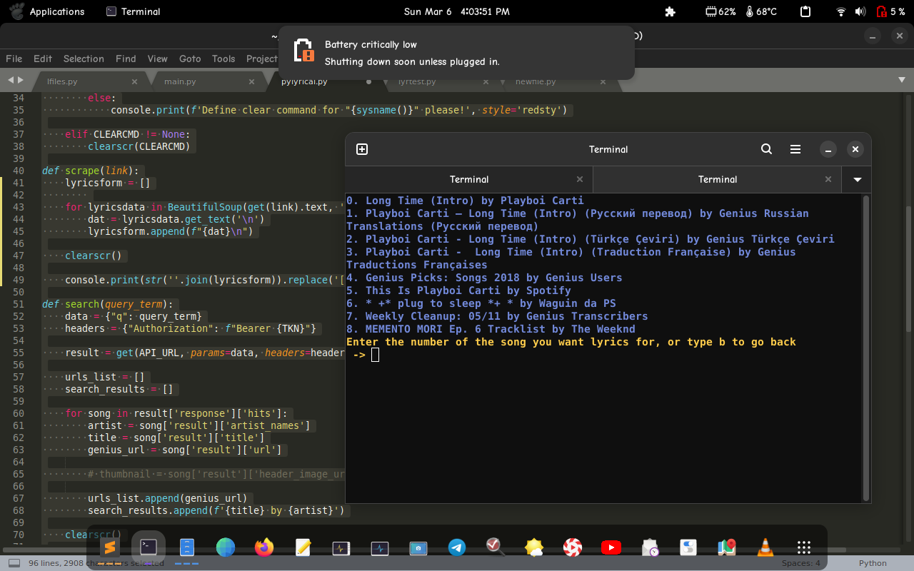

Ever wanted to easily get lyrics on your terminal? (*No?*) Well now you can!
With pylyrical, you can get lyrics for almost every song (*if genius website has wrote them*) from [genius](https://genius.com), the most known website for lyrics, easily in your terminal. All you need to do is search for a song, select the right one, and there you go

# Setup

First, you will need to get an **access token** to use pylyrical by [creating a client](https://genius.com/api-clients), clicking **Generate Access Token** and copying the token. After that, you will need to paste it on line 15 on the "pylyrical.py" file. (*you need to remove "ACCESS_TOKEN-1234569420360_AMOGUS" of course*)

Then you will need to install the needed modules, which are

1. [rich](https://github.com/willmcgugan/rich)
2. [requests](https://pypi.org/projects/requests/)
3. and [bs4](https://pypi.org/projects/beautifulsoup4/)

You can install them by opening a terminal window, and typing **pip3 install bs4 requests rich**

After that, you will need to git clone this module (git clone https://github.com/devlocalhost/pylyrical.git), then you will need to change your directory to pylyrical, and run the python file

**MAKE SURE YOU HAVE THE LATEST PYTHON VERSION, OR A VERSION HIGHER THAN 3.7. IT IS NOT GUARANTEED THAT IT WILL WORK BELOW 3.7**

# Compatibility

It *probably* works on every platform, such as *nix-like platforms, and maybe windows. Im not really sure if it works on windows. *I hope it does lol*

# Issues

If you find any issue, please copy the traceback (screenshot suggested instead), and open an issue. Make sure you include:

1. Your python version (python3 -V)
2. Your distro version and name (for example debian 11) or your windows version if you're using windows
3. The traceback

# Note

Sometimes, pylyrical *might not* return the lyrics, but some random text. Thats why im using a *while True* block (line 44) to avoid this issue. If this happens, please make an issue, and post the results so i can fix it.
